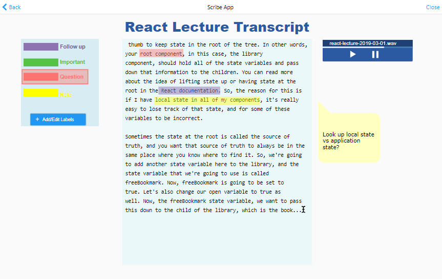
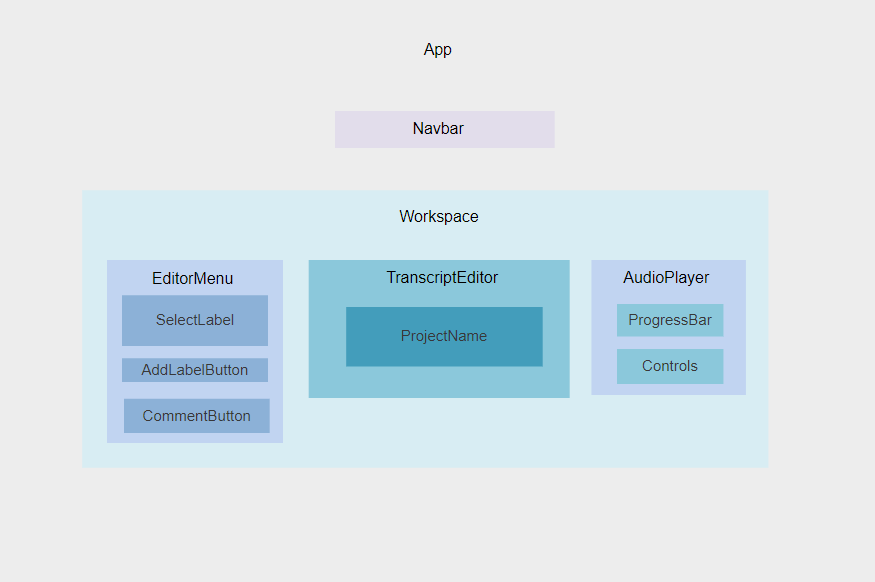

# Scribe

##### A transcription and note-taking app

##### by Leilani Leach 3-1-2019

## Description

This web app will use speech-to-text to transcribe audio from recorded lectures or interviews, letting the user take notes on and highlight the transcript. More details on Google Docs:
<a href='https://docs.google.com/document/d/1mKV7N1Kzqx_CwlZm8lDKepNNE6lsh-h213uBNj2KPco/edit?usp=sharing'>Capstone Project Proposal with User Stories</a>

## Mockup

## Roadmap

| Wishlist                   | In Progress                                 | Completed                                       |     |     |
| -------------------------- | ------------------------------------------- | ----------------------------------------------- | --- | --- |
|                            |                                             | Call STT API and console.log transcript results |     |     |
|                            |                                             | User can upload file to transcribe              |     |     |
|                            |                                             |  Call STT API and display transcript to user    |     |     |
|                            |   Editable transcript                       |                                                 |     |     |
| Highlight text             |                                             |                                                 |     |
| Comment on text            |                                             |                                                 |     |
| Download/export transcript |                                             |                                                 |     |

## Component Diagram

## Planning Component State

#### **Workspace Container Component**

- File selected
- File being transcribed
- Transcript displayed

#### **Audio Uploader Component**

- File selected
- File encoded?
- API called?

#### **Transcript Editor Component**

- Transcript displayed
- Transcript being edited
- Transcript being highlighted

#### **Editor Menu Component**

- Highlighting mode turned on
- Highlighter color selected
- Commenting mode turned on

This project was bootstrapped with [Create React App](https://github.com/facebook/create-react-app).
